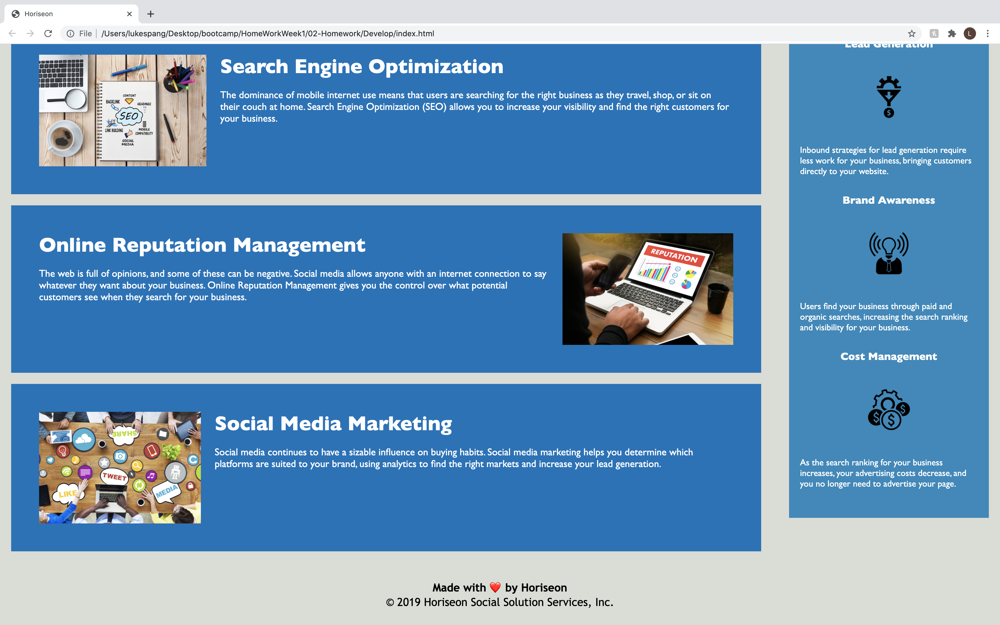

# Horiseon Code Refactor

The task presented to us for this project was to update and consolidate html and css code for the Horiseon website. In particular we are to 
1) Refactor existing code.
2) Ensure the website features continue to work, and fix the ones that are not.
3) Make changes to the code so that the website complies to accessibility criteria

The updated website can be seen below and found at https://lukespang.github.io/Horiseon-Code-Refactor/

